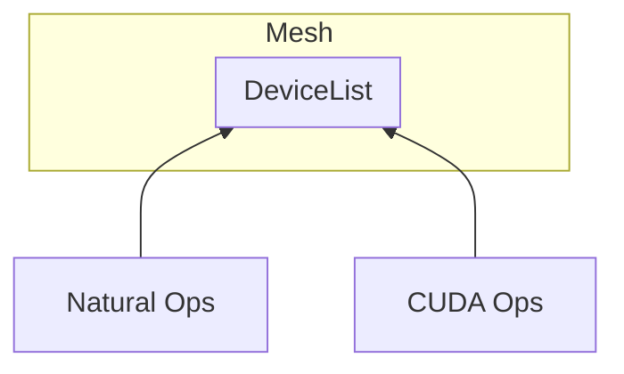
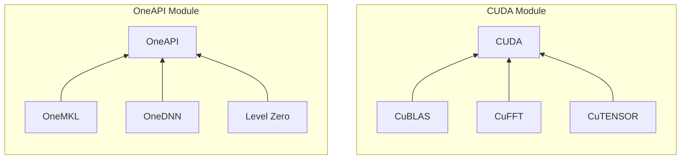

```mermaid

flowchart TB
  subgraph MESH
    direction TB
    
    subgraph OpManager
        direction TB
        OFE[Op Fusion Engine]
    end
    
    subgraph TranslationLayer
        direction TB
        
        DeviceManager --> INTEL_Module[OneAPI Module]
        DeviceManager --> CUDA_Module[CUDA Module]
        DeviceManager --> Other_Module[Other Modules]
    end
  end
  
  subgraph NVIDIA
   NVIDIA_GPU[GPU]
  end
  
  subgraph INTEL
   INTEL_CPU[CPU]
   INTEL_GPU[GPU]
   INTEL_FPGA[FPGA]
  end
  
  * -- Ops ---> OpManager
  OpManager --> TranslationLayer

  CUDA_Module --> NVIDIA:::Green
  INTEL_Module --> INTEL:::Blue
  
  classDef Blue fill:#003366
  classDef Green fill:#003600
```

# Mesh

## Introduction
Mesh allows optimized software to be accelerated on any supported architecture, and autoscale to multiple backends.

`Application -> Mesh -> GPUs, CPUs, TPUs, cloud services, custom SoCs (embedded devices), HALs`

## Motivation
The next generation of chips will be custom-tuned to specific use cases. Having an automatically managed compute context will allow developers to seamlessly make use of different logical devices.

However, to minimize performance penalties, Mesh uses optimized libraries for each vendor.

## How it Works

Mesh essentially works as a translation layer between an application (Tensorflow / PyTorch / etc.) and logical devices (or other HALs). In the current implementation, we use preprocessor directives to conditionally compile anything related to CUDA. 

Mesh is a data struct that holds information about the available devices (in the DeviceList struct). To populate the Mesh object, we invoke the config function. This function decides what kind of devices are available and call appropriate config functions. 

Natural config is fake - we're assuming a CPU is compiling the program. It should be removed in the future.

CUDA config gets the number of CUDA devices, and other information and attempts to append information to DeviceList.

### How to Use

To check your OS, arch, if CUDA exists:

`make check_host`

To see if Mesh is being properly configured:

`make test`

This just runs test.c which right now prints out everything in DeviceList.

## Roadmap

Software support for (in order):
- C (under development)
- python
- Micrograd
- Tinygrad
- numpy
- XLA

Hardware library support for (in order):
- NVIDIA CUDA (under development)
- Intel OneAPI
- WASM + WebGPU
- Cloud Platforms (AWS, Azure, GCP, other)
- Vulkan compute

Features:
- XLA-type op fusion engine
- Mesh node to act as a worker on non-host devices

