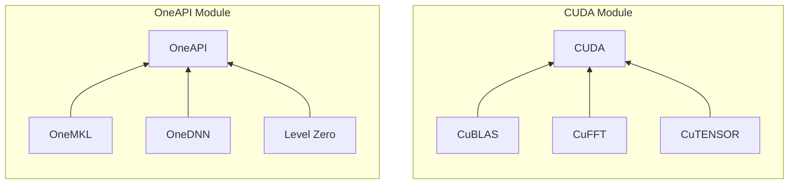

```mermaid

flowchart TB
  subgraph MESH
    direction TB
    
    subgraph OpManager
        direction TB
        OFE[Op Fusion Engine]
    end
    
    subgraph TranslationLayer
        direction TB
        
        DeviceManager --> INTEL_Module[OneAPI Module]
        DeviceManager --> CUDA_Module[CUDA Module]
        DeviceManager --> Other_Module[Other Modules]
    end
  end
  
  subgraph NVIDIA
   NVIDIA_GPU[GPU]
  end
  
  subgraph INTEL
   INTEL_CPU[CPU]
   INTEL_GPU[GPU]
   INTEL_FPGA[FPGA]
  end
  
  * -- Ops ---> OpManager
  OpManager --> TranslationLayer

  CUDA_Module --> NVIDIA:::Green
  INTEL_Module --> INTEL:::Blue
  
  classDef Blue fill:#003366
  classDef Green fill:#003600
```

# Mesh

## Introduction
Mesh allows optimized software to be accelerated on any supported architecture, and autoscale to multiple backends.

`Application -> Mesh -> GPUs, CPUs, TPUs, cloud services, custom SoCs (embedded devices), HALs`

## Motivation
The next generation of chips will be custom-tuned to specific use cases. Having an automatically managed compute context will allow developers to seamlessly make use of different logical devices.

However, to minimize performance penalties, Mesh uses optimized libraries for each vendor.

## Roadmap

Support for:
python
Micrograd
Tinygrad
numpy
XLA

Intel OneAPI
NVIDIA CUDA
WASM + WebGPU
Cloud Platforms (AWS, Azure, GCP, other)
Vulkan compute

Features:
XLA-type op fusion engine

