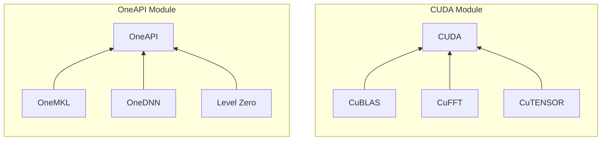

# Mesh

```mermaid

flowchart TB
  subgraph MESH
    direction TB
    
    subgraph OpManager
        direction TB
        OFE[Op Fusion Engine]
    end
    
    subgraph TranslationLayer
        direction TB
        
        DeviceManager --> INTEL_Module[OneAPI Module]
        DeviceManager --> CUDA_Module[CUDA Module]
    end
  end
  
  subgraph NVIDIA
   NVIDIA_GPU[GPU]
  end
  
  subgraph INTEL
   INTEL_CPU[CPU]
   INTEL_GPU[GPU]
   INTEL_FPGA[FPGA]
  end
  
  * -- Ops ---> OpManager
  OpManager --> TranslationLayer

  CUDA_Module --> NVIDIA:::Green
  INTEL_Module --> INTEL:::Blue
  
  classDef Blue fill:#003366
  classDef Green fill:#003600
```

```mermaid
flowchart TB
  subgraph CUDAMod[CUDA Module]
   direction BT
   CuBLAS --> CUDA
   CuFFT --> CUDA
   CuTENSOR --> CUDA
  end

  subgraph OneAPIMod[OneAPI Module]
   direction BT
   OneMKL --> OneAPI
   OneDNN --> OneAPI
   LZ[Level Zero] --> OneAPI
  end
```
